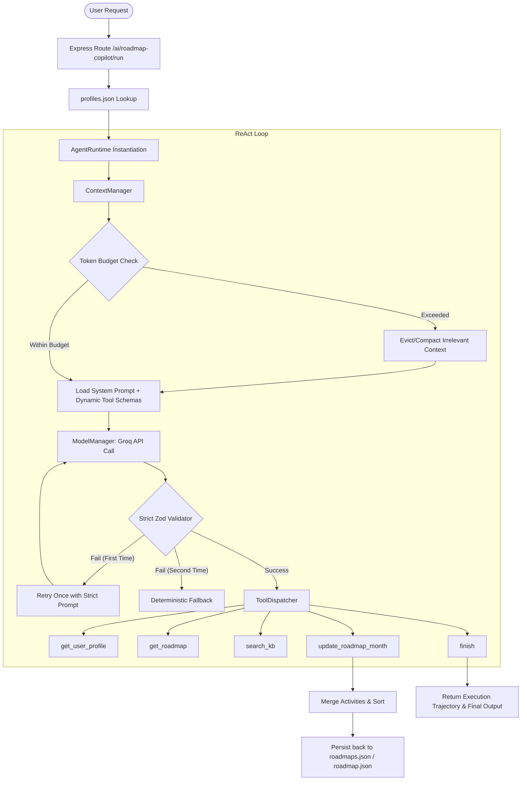

# Roadmap Copilot Agent

This is a dynamic, token-optimized Roadmap Copilot Agent. It uses a structured ReAct (Reasoning and Action) loop to read active user profiles, retrieve curriculum guides, search a technical knowledge base, and dynamically update user roadmap paths based on conversational requests.

---

## Architecture

Below is the execution flow and system architecture:



---

## High-Level Design (HLD) in Plain Words

Here is how the copilot actually works:

### 1. The Core Loop (ReAct)
When you ask the copilot to do something (like "Add Express to month 4 and save it"), it doesn't just make a single LLM call. It enters a loop. It thinks (Reasoning) and decides to execute a tool (Action), checks the outcome, and continues until it is finished/max steps reached.

### 2. Guarding the Token Budget (Context Compaction)
LLM calls have limit budgets. If the conversation history is long (e.g. off-topic chat or massive roadmap payloads), the `ContextManager` steps in. It analyzes token counts. If the budget is exceeded, it evicts or summarizes large blocks of chat history (like long off-topic tutorial text) to ensure the system prompt and core task goals are preserved.

### 3. Absolute Type-Safety & Self-Correction
We use strict Zod schemas to validate every single tool call from the LLM. If the model outputs the wrong keys (e.g., mixing up `"activities"` with `"topics"`), it is caught.
* **Auto-Resolution**: The system prompt is dynamically populated with parameters schemas during load time so the model knows exactly what to output.
* **Smart Retry**: If the model still makes a mistake, the agent automatically retries exactly once with a stricter instruction detailing the exact schema mismatch. If it fails a second time, it yields a deterministic fallback.

### 4. Smart Data Merging & Persistence
When modifying a roadmap:
* **Merge, Don't Overwrite**: If you update month 4, it merges the new activities with the existing ones using a Set (preventing duplicate items) rather than replacing them.
* **File System Persistence**: The changes are written directly back to the database files (`profiles.json`, `roadmaps.json`, `roadmap.json`) in the filesystem, making them permanent.

---

## Getting Started

### Prerequisites
* **Node.js**: `v18+` or later.
* **API Key**: A valid Groq API key.

### Setup Environment
1. Set up your `.vscode/launch.json` or `.env` file with your Groq credentials:
```env
LLM_PROVIDER=groq
LLM_API_KEY=your-groq-api-key
LLM_BASE_URL=https://api.groq.com/openai/v1
LLM_MODEL=llama-3.3-70b-versatile
```

2. Install dependencies:
```bash
npm install
```

### Running the App
* Run the dev server:
```bash
npm run dev
```
* Visit `http://localhost:3000` to interact with the visual web panel, select active users (Priya, Vicky, or Ash), and trigger the ReAct copilot loop!

### Testing
Have cover multiple integration scenarios offline using robust Vitest spied environments:
```bash
npm test
```
The test suite validates:
1. **Scenario 1**: Priya Sharma's Data Science track (MLOps addition, unconfirmed guardrails, and confirmed updates).
2. **Scenario 2**: Vicky B's AI Engineering track (Backend/Express addition and confirmed merges).
3. **Scenario 3**: Ash's Cybersecurity track (Knowledge base search, pentesting tool lookups, and confirmed updates).
